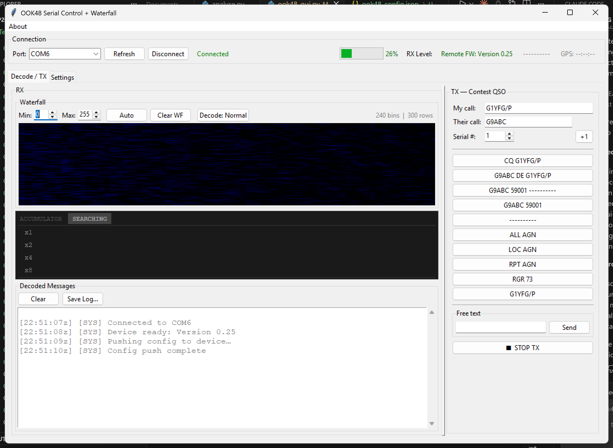

# OOK48 Headless Serial + Desktop GUI

A modified RP2350/RP2040 OOK48 build where the touchscreen UI is replaced by a USB serial
control path and a desktop Python GUI.

All spectrum/waterfall rendering, operating controls, decode display, message management, and logging move to the PC GUI.

## Quick Links

- Latest release (download `.exe` / `.uf2`): https://github.com/rszemeti/RP2040_OOK48_Headless/releases/latest

## GUI (Front and Center)



The GUI is now the primary operator interface:

- **Live decode console** with RX/TX/error colouring and UTC timestamps
- **Contest TX pad** with dynamic templates (`{myCall}`, `{theirCall}`, `{serial}`, `{loc}`)
- **Confidence-aware decode pipeline** with unknown-gating and accumulator state display
- **Waterfall controls** (clip, auto-scale, clear) and decode mode quick-toggle
- **Persistent config** for callsign, timing, mode, and TX templates

---

## Performance vs Single-Repeat Decode

The firmware stream is effectively single-repeat per symbol period, but the GUI adds a
**soft-accumulator repeat** on top of that data:

- single-repeat characters are shown immediately (fast feedback)
- repeated cycles are accumulated per position and re-decoded with improved confidence
- unstable copy can be promoted to stable copy once mean confidence rises
- low-confidence runs auto-collapse and reset cleanly

This gives a practical improvement in weak/marginal conditions without changing the
core RF/FFT/radio processing code.

Current confidence gates used by the GUI accumulator:

- per-character unknown gate: `0.180` (below this, symbol is treated as unknown)
- confirmed-copy threshold: `0.65` (mean confidence)
- collapse threshold: `0.25` for `3` consecutive cycles

### Expected decode levels (measured)

Normal mode (good copy guideline):

- 1 repeat: `-17`
- 2 repeats: `-19`
- 4 repeats: `-20`
- 8 repeats: `-21`

Rainscatter mode (good copy guideline):

- 1 repeat: `+5 dB`
- 2 repeats: `+3 dB`
- 4 repeats: `+2 dB`
- 8 repeats: `+1.5 dB`

---

## Rainscatter Mode (Decode Mode 2)

`SET:decmode:2` enables **Rainscatter** mode, which uses wideband power behaviour
intended for bursty/scatter conditions rather than stable narrowband copy.

Operationally:

- firmware switches to decode mode `2`
- GUI can toggle Normal/Rainscatter from the RX pane button
- if connected firmware does not support mode `2`, GUI falls back to Normal safely

Use Rainscatter when copy is intermittent and burst-dominated; use Normal for steady
paths.

---

## What Changed From the Original

### Removed Entirely
- `config.ino` — replaced by serial `SET:` commands
- `GetApp.ino` — app selection now via `SET:app:`
- `MemPad.ino` — message slot selection now via `CMD:txmsg:`
- `TextPad.ino` — message text entry now via Python GUI
- `USBDrive.ino` — SD card logging is handled by the Python GUI instead
- All SD card hardware support (`SdFat`, `Adafruit_TinyUSB`, SPI1 setup)
- EEPROM read/write — settings are held in RAM and pushed from Python on connect
- Battery voltage measurement and calibration
- All touchscreen UI — buttons, config pages, keyboard, memory pad

### Modified
- `RP2040_OOK48_Serial.ino` — main file rewritten for RP2350/RP2040 targets: serial protocol added,
  `defaultSettings()` replaces EEPROM load/save, LCD init simplified
- `globals.h` — SD, battery, and EEPROM-specific variables removed;
  `core0Ready` flag added for core synchronisation
- `GUI.ino` — stripped to spectrum/waterfall/legend drawing only
- `DEFINES.h` — SD card pin definitions removed

### Unchanged
- `DMA.ino`, `FFT.ino`, `Rx.ino`, `Tx.ino`, `JT4Decode.ino`,
  `PI4Decode.ino`, `fano.ino` — all radio processing untouched

---

## How It Works

The RP2350/RP2040 enumerates as a USB CDC serial device (virtual COM port) when connected
to a laptop. The Python GUI connects to this port at 115200 baud.

On boot the firmware applies safe defaults and sends `RDY:<version>`. The Python
GUI responds by pushing all configuration settings. From that point on, decoded
messages stream out as simple prefixed ASCII lines and the GUI sends commands back
as needed.

The LCD shows the spectrum and waterfall continuously during RX, and a red TX
indicator during transmit — exactly as before, just without anything else on screen.

Protocol details for firmware/GUI integration are in `gui/ook48_serial_protocol.md`
and `Documents/ook48_serial_protocol.md`.

---

## Firmware Releases (UF2)

For RP2350/RP2040 Pico-class targets, the easiest install format is **UF2** (not `avrdude`).

### RP2350 boards replacing RP2040

New Pico-compatible boards are increasingly RP2350-based and are generally the default choice now.
For this project, treat RP2350 as the modern replacement for RP2040: use the same UF2 workflow,
and keep using RP2040 hardware where already deployed.

### Download latest release assets

1. Open the project **Releases** page on GitHub:
  - https://github.com/rszemeti/RP2040_OOK48_Headless/releases/latest
2. Open the newest release (top of the list).
3. Under **Assets**, download:
  - `*.uf2` (firmware for the RP2350/RP2040 board)
  - `OOK48_GUI.exe` (Windows desktop GUI)

If Windows warns about SmartScreen, click **More info** → **Run anyway**.

### Flash UF2 to RP2350/RP2040 (BOOTSEL method)

1. Unplug the RP2350/RP2040 board from USB.
2. Press and hold the **BOOTSEL** button (some boards label this as **BOOT**).
3. While still holding BOOTSEL, plug the USB cable into the PC.
4. Release BOOTSEL after the board appears as a USB drive named **RPI-RP2**.
5. Drag/copy the downloaded `*.uf2` file onto that **RPI-RP2** drive.
6. Wait a few seconds; the drive disconnects automatically and the board reboots into the new firmware.

If your board has a separate **RESET/RUN** button, you typically still need to hold **BOOTSEL** (not RESET) during plug-in to enter UF2 bootloader mode.

---

### Windows 

The easiest solution for running the GUI on Winows is to download our "one file" release.

- `dist/OOK48_GUI.exe`

This is a prebuilt GUI instead of running all the Python stuff locally, just download `OOK48_GUI.exe` from the latest GitHub Release assets (see **Download latest release assets** above).

## Python GUI

If you want to fiddle with the GUI and make changes, running the rawPython version is for you.

- **`ook48_gui.py`** — standard GUI with waterfall


### Requirements
```
pip install -r gui/requirements.txt
```

### Running
```
python ook48_gui.py
```

### Features

**Connection bar** — port selector, connect/disconnect, GPS time and locator
displayed live from `STA:` updates.

**Decode / TX tab** — split vertically into RX (left) and TX (right) panes.

- **RX pane** — colour-coded decode output: green=RX, red=TX echo, orange=error,
  dark green=JT4, purple=PI4, grey=system. Each message is prefixed with a UTC
  timestamp when its first character arrives. Double-clicking any received (green)
  word sets it as "Their call" in the TX pane.
  Clear button clears the screen only — the log file is unaffected.
  Save Log writes the current screen content to a file.

- **TX pane — Contest QSO pad** — designed for rapid contest operation:
  - **My call** — your callsign, persisted between sessions
  - **Their call** — type or double-click a received callsign to populate
  - **Serial #** — contest serial number with +1 button, persisted between sessions
  - All fields update the 10 slot buttons live as you type
  - **Single click** on any slot button immediately transmits that slot
  - **■ STOP TX** halts transmission and returns to RX

**TX message slots** — 10 slots are template-driven and rendered live from your
current operating fields.

The default slot template set:

| Slot | Content |
|------|---------|
| 0 | `CQ {myCall}` |
| 1 | `{theirCall} DE {myCall}` |
| 2 | `{theirCall} 59{serial} {loc}` |
| 3 | `{theirCall} 59{serial}` |
| 4 | `{loc}` |
| 5 | `ALL AGN` |
| 6 | `LOC AGN` |
| 7 | `RPT AGN` |
| 8 | `RGR 73` |
| 9 | `{myCall}` |

`{loc}` is substituted with live GPS locator data from `STA:`. Other substitutions are
rendered in the GUI before sending each slot to firmware.

Templates are user-editable in `ook48_config.json` (`messages[]`) and can be changed
without touching code.

**Settings tab** — all firmware parameters with Apply, Save, and Reboot buttons.

**File logging** — everything shown in the decode window is also written to
`ook48_YYYYMMDD.log` in the same directory, opened automatically on startup.
Multiple sessions on the same day append to the same file with a session marker.

### Waterfall (ook48_waterfall.py only)

A waterfall display sits above the decode text in the RX pane. It renders `WF:`
lines from the firmware as a scrolling thermal colour map (black → blue → cyan →
green → yellow → red).

- **Min / Max** spinboxes clip the colour range to the interesting signal level
- **Auto** sets Min/Max from the actual data range
- **Clear WF** clears the waterfall history
- **▶ Fake WF** generates synthetic test data at 9 rows/second — useful for
  testing the display without hardware connected

The waterfall adapts automatically to however many bins the firmware sends and
scales horizontally to fill the available window width.

### Config file (`ook48_config.json`)

Created automatically on first run. Persists port, callsign, serial number, and
all firmware settings between sessions. Example:

```json
{
  "port": "COM3",
  "callsign": "G4EML",
  "serial": 1,
  "gpsbaud": 9600,
  "loclen": 8,
  "decmode": 0,
  "txadv": 0,
  "rxret": 0,
  "halfrate": 0,
  "app": 0,
  "messages": [
    "CQ {myCall}",
    "{theirCall} DE {myCall}",
    "{theirCall} 59{serial} {loc}",
    "{theirCall} 59{serial}",
    "{loc}",
    "ALL AGN",
    "LOC AGN",
    "RPT AGN",
    "RGR 73",
    "{myCall}"
  ]
}
```

---

## Credits

- Colin Durbridge (G4EML) — original OOK48 work
- Robin Szemeti (G1YFG) — RP2040_OOK48_Headless (RP2350/RP2040) serial + GUI adaptation

---

## Notes

**GPS locator** — the locator shown in the connection bar is received from the
firmware via `STA:` lines and is used live in the TX slot buttons. If GPS has not
yet locked, `{LOC}` is passed through to the firmware for its own substitution.

**GPS baud rate** — `autoBaud()` detection is removed. The firmware starts at 9600
by default. If your GPS module runs at 38400, change `gpsbaud` in `ook48_config.json`
before first connect, or set it in the Settings tab and click Apply.

**First connect** — there is a 1.5 second delay after connecting before the config
push is sent, to allow the firmware time to finish booting and send its `RDY:` message.

**App switching** — changing the app via `SET:app:` causes an immediate reboot. The
Python GUI will show a disconnect; simply reconnect after a few seconds.

**TX echo** — transmitted characters are echoed back by the firmware as `TX:` lines
and appear in red in the decode window as they are actually sent, one character at
a time.